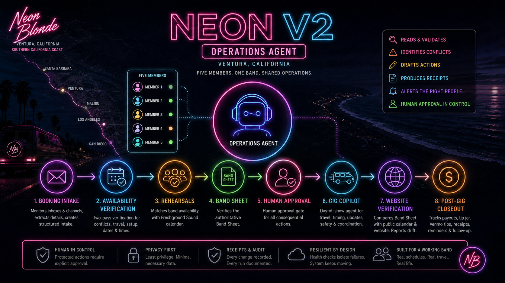
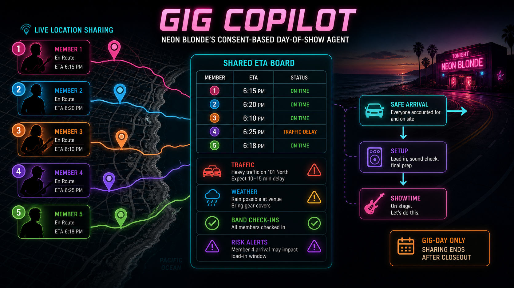

<div align="center">

# Neon V2

### The agentic operations system behind Neon Blonde

**Ventura, California · Five musicians · One shared operational picture**

</div>



Neon V2 is a supervised operations agent built for **Neon Blonde**, a five-member band based in Ventura, California, performing up and down the Southern California coast.

Running an active band means coordinating far more than a set list. Booking inquiries arrive through email and messages. Five people have jobs, travel constraints, unavailable dates, rehearsals, equipment, and changing arrival times. Venue details must stay aligned across calendars, the Band Sheet, local files, public show listings, and band communication. After each show, payouts and multiple types of tips still need to be closed out.

Neon V2 connects those moving parts. It reads operational sources, validates information, identifies conflicts, drafts actions, produces receipts, alerts the right people, and keeps human approval in control of consequential changes.

> Neon V2 is not a fictional chatbot or an autonomous booking authority. It is an operational agent designed to make band logistics clearer, safer, and harder to drop.

## What Neon V2 Does

Neon V2 supports the complete gig lifecycle:

1. **Booking intake** — monitors approved inboxes and communication channels, recognizes potential booking requests, extracts dates and venue details, and creates structured intake records.
2. **Availability verification** — checks existing gigs, member outs, travel and setup constraints, calendar plausibility, and conflicting information through an independent two-pass process.
3. **Human approval** — stops protected actions until Mike confirms the booking, communication, publishing, rate, or payment decision.
4. **Rehearsal coordination** — compares band availability with Freshground Sound rehearsal availability and helps generate workable rehearsal options.
5. **Confirmed-gig operations** — maintains venue records, local gig folders, reconciliation receipts, Band Sheet data, communication context, and public-show verification.
6. **Show-day coordination** — Gig Copilot helps the five members travel safely, respond to changes, and arrive with enough time to load in and perform.
7. **Post-gig closeout** — tracks base payout, cash tip jar, Venmo tips, payment details, missing information, reminders, and rebooking follow-up.

## Core Capabilities

### Booking and communication intake

Neon V2 processes booking-related messages from Gmail, AgentMail, Telegram, and GroupMe without treating every message as a confirmed gig. Intake and booking are separate phases: a request can be parsed, summarized, and queued without altering a calendar or publishing anything.

Known contacts, unknown senders, incomplete details, possible date changes, and venue mismatches receive different handling. The system keeps a local record of what it saw and what still needs a person to decide.

### Availability intelligence

A date is only reported as clear when it passes two independent checks:

- no confirmed gig conflict
- no member-out conflict
- no travel or setup contradiction
- plausible date and time
- agreement between verification passes

Weekday shows, unusually early start times, missing locations, and Southern California travel constraints are surfaced for review rather than silently accepted.

### Band Sheet and website verification

The published Band Sheet is the operational source for confirmed gigs. Neon V2 compares it against the public Neon Blonde calendar and the public website, normalizes show information, and reports drift before incorrect dates or locations spread further.

The system can produce plain-language schedules, upcoming-gig summaries, open days, fully free weekends, and reconciliation reports without exposing raw calendar data.

### Rehearsals

Neon V2 cross-references member availability, booked shows, travel constraints, and Freshground Sound's calendar. It can shortlist rehearsal dates and draft reservation communication while leaving the actual scheduling decision with the band.

### Dashboard and health monitoring

The local dashboard consolidates operational status across booking intake, gig records, verification checks, post-gig queues, and agent health. Scheduled read-only health checks isolate failures so one broken data source does not silently corrupt another workflow.

### Telegram, GroupMe, and agent handoffs

Neon V2 brings band information into conversational tools without creating a second source of truth. Telegram Bot and Gig Copilot provide focused operational access, while GroupMe synchronization preserves current band communication context for authorized workflows.

Codex, Claude, Gemini, and Hermes can operate the system through a shared compatibility and credential-parity model. They use the same operational rules, approval gates, and canonical credential sources.

## Gig Copilot: Day-of-Show Coordination



Gig Copilot is Neon Blonde's day-of-show coordination agent.

The members of Neon Blonde have jobs, commitments, different starting locations, and different routes to each venue. On gig day, repeatedly checking a group chat is not always practical or safe. Gig Copilot is designed to maintain a shared operational picture while the band is working, loading equipment, or driving.

Its show-day responsibilities include:

- **Consent-based live location sharing** during the active gig-day window
- **Shared ETAs** for all five members
- **Traffic monitoring** and delay awareness
- **Weather monitoring** for travel, load-in, and outdoor-show risks
- **Member check-ins** and manual updates when work or traffic changes a plan
- **Risk alerts** when arrival, setup, or showtime is threatened
- **Gig changes** distributed without requiring everyone to continuously watch a phone
- **Coordinated arrival and setup** so the band knows who is en route, delayed, onsite, or ready

Live location sharing is intended for gig-day coordination, not permanent tracking. It is activated with member consent for the operational window and ends when the show-day workflow closes.

The current repository contains the Gig Copilot foundation, Telegram transport, member profiles, message handling, scheduled gig-day broadcasts, and supporting tests. Expanded live location, traffic, and weather intelligence are part of the continuing Gig Copilot implementation.

## Post-Gig Operations

After a show, Neon V2 activates a closeout queue and keeps the administrative work visible until it is complete.

The authoritative payout record separates:

- `PAYOUT` — base pay received
- `TIP_JAR` — cash collected in the physical tip jar
- `VENMO` — electronic Venmo tips

Historical `TIPS` values are preserved by migrating them into `TIP_JAR`. For current gigs, blank payout fields stay actionable; an explicit `$0.00` counts as completed information.

## Human Control and Safety

Neon V2 can reason, monitor, compare, summarize, draft, and recommend. Deterministic scripts handle parsing, normalization, validation, local records, and reports. Mike retains control over source-of-truth decisions.

The following actions remain protected:

- confirming or changing a booking
- creating, editing, or deleting Google Calendar events
- sending venue-facing email
- publishing the Band Sheet
- updating the public WordPress site
- sharing venue portal files
- changing rates or booking terms
- marking a payment complete

When sources disagree or a required service fails, Neon V2 blocks the affected write, records what did and did not change, and provides the next safe action.

## System Architecture

```text
Email / AgentMail / Telegram / GroupMe
                    |
                    v
           Booking Intake Layer
                    |
                    v
     Validation + Availability Checks
                    |
                    v
            Human Approval Gate
                    |
       +------------+-------------+
       |                          |
       v                          v
Confirmed Gig Operations     Draft / Review Queue
       |
       +--> Band Sheet and website verification
       +--> Venue folders and reconciliation records
       +--> Rehearsal coordination
       +--> Gig Copilot
       +--> Post-gig payout and reminder queue
```

### Operational sources

| Source | Responsibility |
|---|---|
| Band Sheet | Authoritative confirmed-gig publication |
| Public Neon Blonde calendar | Member outs, dates, times, locations, and scheduling context |
| Gmail / AgentMail | Booking intake and approved operational communication |
| Freshground calendar | Rehearsal-space availability |
| GroupMe | Current band communication context |
| Telegram | Conversational operations and Gig Copilot transport |
| WordPress | Public show presentation verified against the Band Sheet |
| Local CSVs and receipts | Payouts, queues, reconciliation, and audit history |

## Repository Map

| Path | Purpose |
|---|---|
| `SKILL.md` | Primary Neon V2 operating authority |
| `AGENT_COMPATIBILITY.md` | Shared agent capabilities, credentials policy, and protected actions |
| `references/` | Availability, booking, rehearsal, Band Sheet, communication, and failure-handling rules |
| `scripts/` | Deterministic intake, verification, monitoring, payout, folder, and health tools |
| `dashboard/` | Local operational dashboard |
| `Telegram Bot/` | NeonBotstein conversational operations and booking watcher |
| `Gig Copilot Bot/` | Day-of-show coordination agent and broadcast tools |
| `launch_agents/` | macOS scheduled automation definitions |
| `tests/` | Main system regression tests |
| `docs/superpowers/` | Approved designs and implementation plans |
| `reports/` | Automation inventory and supervised-pilot records |

## Running and Validating

Neon V2 is designed for Mike's local operational environment and depends on configured services that are intentionally not stored in Git.

Before using credentials, APIs, or protected operations:

```bash
python3 scripts/agent_compatibility_check.py --agent codex
```

Run the main regression suite:

```bash
python3 -m unittest discover -s tests -p 'test_*.py'
```

Run the Telegram Bot suite:

```bash
PYTHONPATH='Telegram Bot' python3 -m unittest discover -s 'Telegram Bot/tests' -p 'test_*.py'
```

Run the Gig Copilot suite:

```bash
PYTHONPATH='Gig Copilot Bot' python3 -m unittest discover -s 'Gig Copilot Bot/tests' -p 'test_*.py'
```

Secrets, runtime receipts, logs, local tool state, and private operational data are excluded from version control.

## Project Status

Neon V2 is an active, supervised production agent. Booking intake, verification, health monitoring, venue operations, public-show comparison, Telegram workflows, post-gig payout tracking, and reminder infrastructure are implemented at varying levels of production maturity.

Gig Copilot's bot foundation and show-day communication framework are implemented. Richer live location sharing, route intelligence, traffic monitoring, and weather-driven alerts remain an active development lane.

## Why This Repository Exists

Neon V2 is both a working band-management agent and a practical example of agentic software applied to a real small organization. It demonstrates how AI reasoning, deterministic tools, human approval, multiple communication channels, and durable operational records can work together without handing uncontrolled authority to a model.

The goal is simple: fewer dropped details, fewer conflicting versions of the truth, safer travel, better-informed decisions, and five musicians arriving ready to play.
