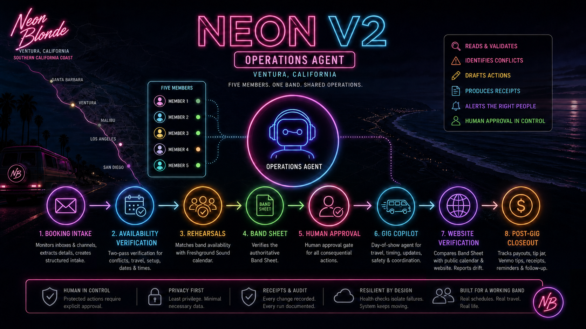
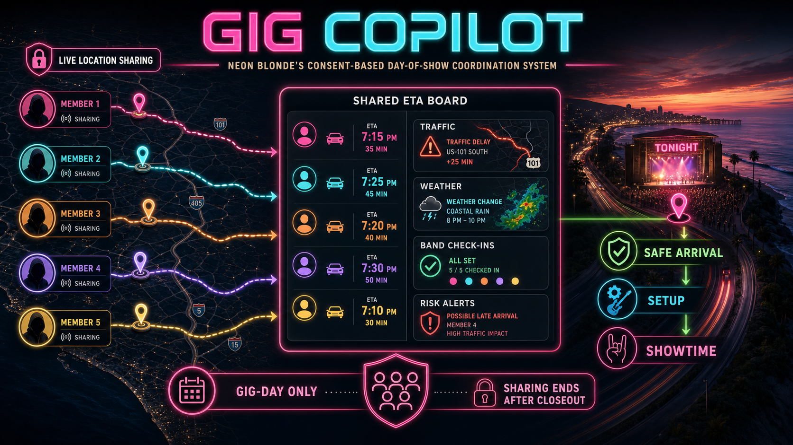
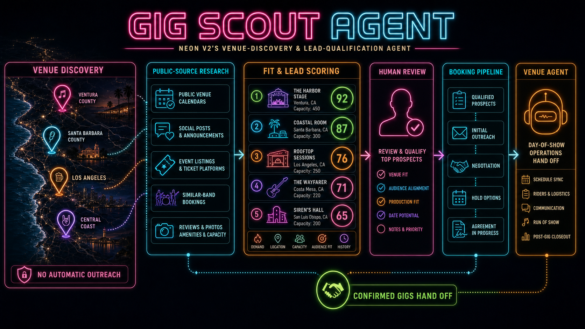

# Neon V2

Neon V2 is the supervised band-operations system for **Neon Blonde**. It helps the band stay ahead of booking conversations, schedule conflicts, gig-day travel, member communication, contacts, and post-show closeout.

The system runs through two Hermes profiles using `gpt-5.6-luna`:

| Profile | Role |
|---|---|
| `neon-v2` | Email and Telegram triage, booking support, Band Sheet verification, contacts, and general band operations |
| `neon-co_pilot` | Day-of-gig check-ins, travel guidance, schedule verification, updates, and post-gig closeout |

`SKILL.md` is the operating authority for both profiles. The scripts in this repository provide deterministic support for its workflows.



## Primary Mission: Communication Triage

Neon V2's most important job is to watch Neon Blonde's operational communications and make sure important details do not get lost.

It should identify and surface:

- new gig and pricing inquiries
- conversations that need a reply or follow-up
- questions involving money, contracts, deposits, or payment
- schedule, venue, load-in, arrival, and showtime changes
- conflicts between messages and the published Band Sheet
- unresolved action items in long email or Telegram conversations

The agent acts as Mike's assistant. It can read, reconstruct, summarize, and draft, but it cannot independently send consequential email or change a source-of-truth record.

## Sources of Truth

When information conflicts, Neon V2 uses this hierarchy:

1. The published **Band Sheet** is the operational source of truth for confirmed gig details.
2. Mike can explicitly approve a correction.
3. The corrected information becomes authoritative only after the Band Sheet is updated and published.
4. Email, Telegram, venue messages, and verbal reports are evidence to compare—not silent replacements for the Band Sheet.

The published Band Sheet is available at:

<https://mlmil.github.io/NeonBlonde-Bandsheet/docs/>

For example, if a member reports that a venue owner said the show starts at 5:30 PM but the Band Sheet says 6:00 PM, the bot should immediately flag **Details Wrong** and state both times. Until Mike confirms and publishes a correction, **SHOW STARTS AT 6:00 PM** remains the plan.

## Gmail Operations

Neon V2 reads the Neon Blonde Gmail account through IMAP and sends only approved messages through SMTP. It does not depend on a separate Gmail API integration.

For an active conversation, the agent should:

1. Reconstruct the full Gmail thread, including quoted history when needed.
2. Summarize what was agreed, what changed, and what remains unresolved.
3. Identify dates, locations, pricing, payment terms, logistics, and action items.
4. Draft a reply in the band's voice.
5. Show Mike the exact draft and wait for explicit approval.
6. Send only the approved version.

The agent must never infer approval from silence or from a general instruction to “handle it.” A venue-facing message requires approval of the actual draft.

Relevant tools include:

- `scripts/monitor_inbox.py`
- `scripts/list_recent_emails.py`
- `scripts/booking_email_notifier.py`

## Telegram Operations

The authorized Neon Blonde group is `-1004424634571`, and the primary bot is `@neonblondebot`.

Neon V2 watches ordinary group messages for operational changes and conflicts. Members can also mention the bot to ask about schedules and gigs. The bot should answer from the Band Sheet and clearly distinguish showtime from arrival, load-in, soundcheck, and other times.

When messages contain new or conflicting details, Neon V2 should:

- quote or clearly identify the reported detail
- compare it with the Band Sheet
- alert the group when the conflict could affect the gig
- request Mike's decision when a correction is needed
- keep using the published Band Sheet until the correction is approved and published

### Member onboarding

Each member completes a one-time onboarding process:

1. In the authorized group, post `@neonblondebot onboard me`.
2. The system verifies group membership and preapproves the member in both Hermes profiles.
3. The member presses **Start** in each bot's private chat.

After that, the bots can send that member gig-day direct messages without requiring a new pairing for every gig. `scripts/onboard_telegram_member.py` supports the process.

## Gig Co-Pilot



Gig Co-Pilot is Neon Blonde's day-of-gig safety net. On a gig morning, it starts an individual check-in with every participating member so the band knows that each person has seen the plan.

The morning message should prominently state:

- venue and full destination
- **SHOW STARTS** time
- arrival, load-in, and soundcheck times as separate fields
- the member's departure origin
- recommended leave-by time
- traffic, construction, weather, parking, and access risks
- a simple acknowledgement request

Leave-by guidance must use each member's confirmed starting location—not assume that everyone lives in Ventura.

During the day, Co-Pilot can send updated traffic and weather guidance, warn when a member needs to leave soon, and relay human-reported access details that maps may not know, such as a hidden driveway, private gate, alley entrance, or landmark. Important updates can be sent both to the group and directly to affected members.

Location sharing is optional and consent-based. A member may share a Telegram live location during the active gig-day window so the bot can help maintain a shared arrival picture. Tracking must end with that window, and members who do not share location can check in manually.

Before closing the gig-day workflow, the bot asks for:

- base pay received
- cash tip amount
- electronic tip amount
- payment method
- whether a check was received and whether it remains outstanding

Relevant tools include `scripts/post_gig_payout_tool.py`, `scripts/payout_csv_sync.py`, and `scripts/post_gig_reminder.py`.

## Contacts

The only authenticated Google API currently required by Neon V2 is the **Google People API**, used for Neon Blonde contacts.

The contact workflow is approval-gated:

1. Extract a proposed contact from an email or an explicit user request.
2. Search existing Google contacts for likely duplicates.
3. Present the proposed fields and a unique approval ID.
4. Wait for the exact command `APPROVE CONTACT <id>`.
5. Create the contact and return a receipt.

Neon V2 must not automatically add every sender. `scripts/google_contacts_tool.py` implements the contacts workflow.

## Data and Service Access

| Capability | Current source |
|---|---|
| Email | Gmail IMAP/SMTP with a local app-password configuration |
| Telegram | Authorized group and profile-specific Telegram bots |
| Confirmed gig details | Published Band Sheet website |
| Calendar context | Public, read-only calendar access |
| Band files | Locally synchronized Google Drive at `/Users/cthulhu/Desktop/Google Drive` via `NEON_DRIVE_ROOT` |
| Contacts | Google People API with contacts-only OAuth |
| Routes and traffic | Google Maps/Routes services used by Gig Co-Pilot |
| Weather | A configured weather provider used by Gig Co-Pilot |

Google Drive does not require API access because its operational files are synchronized locally. Neon V2 must never write to Google Calendar.

## Human Approval and Safety

The following actions require Mike's explicit approval:

- sending venue- or client-facing email
- confirming or changing a booking
- publishing or changing the Band Sheet
- changing the public WordPress site
- sharing venue files
- changing rates, terms, or contract language
- marking a payment complete
- creating or updating a Google contact

The system may read, compare, summarize, draft, and alert without approval. When a dependency fails or sources disagree, it should say what it could verify, what it could not verify, and what human action is needed.

Secrets, OAuth files, Telegram tokens, email app passwords, runtime receipts, and private band data must remain outside Git.

## System Architecture

```text
Gmail ───────┐
Telegram ────┼──> Neon V2 triage and verification
Band Sheet ──┘              │
                            ├──> alerts and summaries
                            ├──> approval-gated drafts
                            ├──> contact proposals
                            └──> Gig Co-Pilot
                                      │
                                      ├──> morning check-ins
                                      ├──> routes / traffic / weather
                                      ├──> schedule conflict warnings
                                      └──> post-gig closeout
```

## Repository Map

| Path | Purpose |
|---|---|
| `SKILL.md` | Primary Neon V2 operating authority |
| `HERMES.md` | Hermes-specific operating guidance |
| `AGENT_COMPATIBILITY.md` | Shared capabilities, credentials policy, and protected actions |
| `references/` | Detailed booking, availability, communication, and failure-handling rules |
| `scripts/` | Deterministic monitoring, verification, contact, payout, and local-file tools |
| `schemas/` | Structured record definitions, including Gig Scout groundwork |
| `templates/` | Reusable operational message and record templates |
| `scheduled-source-monitoring/` | Scheduled source-monitoring support |
| `telegram-operations-monitoring/` | Telegram operational monitoring support |
| `tests/` | Regression tests |
| `docs/images/` | Current and planned workflow diagrams |

Legacy GroupMe, AgentMail, Vader workstation paths, the previous standalone bot directories, the old dashboard, and local-model experiments are not part of the current architecture.

## Validation

From the repository root, run:

```bash
python3 scripts/agent_compatibility_check.py --agent codex
python3 -m unittest discover -s tests -p 'test_*.py'
```

Useful read-only checks include:

```bash
python3 scripts/neon_health_check.py
python3 scripts/bandsheet_verification_report.py
python3 scripts/website_verification_report.py
```

Some checks require the local credentials and synchronized data that are intentionally excluded from the repository.

## Gig Scout Agent — Future V3 Work



The **Gig Scout Agent** remains in this repository as groundwork for a future Neon V3 effort. It is not part of the current Neon V2 production workflow and should not autonomously research or contact venues unless Mike deliberately activates that work later.

The intended concept is a venue-discovery and lead-qualification agent that can research public opportunities, preserve sources, score fit, identify booking contacts, and prepare a human-reviewed shortlist. Approved leads would then move into the booking pipeline; confirmed gigs would return to the normal Neon V2 workflow.

Existing groundwork is intentionally retained:

- `scripts/scout_agent_tool.py`
- `schemas/scout_leads_schema.json`
- `docs/images/gig-scout-agent-workflow.png`

Gig Scout must remain human-reviewed. It does not own outreach, confirmed gigs, payouts, Band Sheet publishing, or autonomous booking decisions.

## Project Status

Neon V2 is an active, supervised operational system being reconnected and smoke-tested on Neon Blonde's dedicated laptop. Its immediate priorities are reliable Gmail triage, Telegram visibility, Band Sheet conflict detection, member onboarding, local Drive access, contacts, and Gig Co-Pilot readiness.

The goal is simple: fewer missed messages, fewer conflicting versions of the truth, earlier warnings, safer travel, and a band that arrives informed and ready to play.
